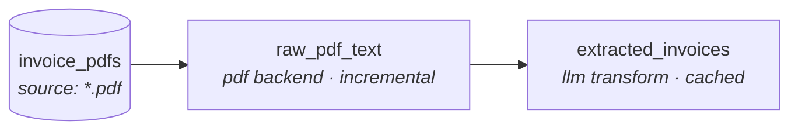

# Constellations

**dbt for unstructured data.** Constellations — installed and invoked as
`stel` — brings the dbt workflow of declarative models, a dependency DAG,
`ref()`, tests, incremental builds, lineage, and a manifest artifact to
folders of documents: PDFs, markdown, HTML, JSON, email, and free-form text.

dbt users will recognize the workflow: declare sources and models in YAML,
build a DAG, materialize incrementally, test the results, and emit artifacts.
`stel` is a standalone CLI rather than a dbt package or dbt adapter.

> **Status: active pure-Python preview.** Shipped capabilities include DuckDB
> and BigQuery warehouses, local and GCS sources, metadata-aware deterministic
> chunk models, record-scoped incremental state, bounded projected warehouse
> snapshots, an incremental local LanceDB search sink, classic text ML, and six
> extraction backends. See
> [`docs/reference.md`](docs/reference.md) for the full reference.

## Platform scope

The active platform roadmap is intentionally narrow:

- **Warehouses:** DuckDB is the default and reference adapter, and MotherDuck
  (`path: md:<database>`) is shipped as its managed deployment — the same
  adapter and capability contract. BigQuery is shipped; Snowflake is planned.
- **Retrieval:** LanceDB is the supported reference store. Additional hosted
  retrieval-store integrations are not currently planned.
- **Embedded dbt execution:** dbt-duckdb only. BigQuery and future Snowflake
  support use the standalone CLI and dbt source handoff.

Existing inference providers and extraction backends remain supported; this
scope governs new platform work rather than removing shipped functionality.

## What a pipeline looks like

A project that turns a folder of invoice PDFs into a structured, queryable
table — extract the text with `pypdf`, then use an LLM to pull typed fields:



Each node is a model declared in YAML. The source globs a folder; `raw_pdf_text`
extracts text per document; `extracted_invoices` calls Claude to turn that text
into typed columns — and caches the result so re-runs are free.

### The source

```yaml
# sources/invoices.yml
version: 2
sources:
  - name: invoice_pdfs
    path: "./data/invoices_pdf/"
    file_pattern: "*.pdf"
```

### The extraction model

```yaml
# models/raw_pdf_text.yml
version: 2
models:
  - name: raw_pdf_text
    source: ref('invoice_pdfs')
    extraction:
      backend: pdf
    materialization: incremental      # re-run only reprocesses changed PDFs
    tests:
      - not_null: [text]
      - unique: source_path
```

### The transform model

```yaml
# models/extracted_invoices.yml
version: 2
models:
  - name: extracted_invoices
    depends_on: [ref('raw_pdf_text')]
    transform:
      type: python
      module: transforms.llm_extract  # a Polars function you write
    tests:
      - not_null: [vendor, invoice_id, total]
      - unique: invoice_id
```

### Run it

```bash
uv run stel init invoices --template pdf   # scaffold a project
# drop your PDFs into ./invoices/data/invoices_pdf/  (or `stel seed` synthetic ones)
cd invoices
uv run stel run                            # build the DAG into DuckDB
uv run stel test                           # run the schema tests
uv run stel show raw_pdf_text               # peek at the scaffolded result
```

```
model                 kind        mater.         processed   skipped  deleted    rows   time(s)
-----------------------------------------------------------------------------------------------
raw_pdf_text          extraction  incremental            5         0        0       5     0.31
```

## Why stel

| | Imperative Python (LlamaIndex) | Managed RAG (Cortex Search, Bedrock KB) | **stel** |
|---|---|---|---|
| Declarative models + DAG | ✗ | partial | ✓ |
| Tests on extracted data | ✗ | ✗ | ✓ |
| Incremental / cached | DIY | ✓ | ✓ |
| Inspect & swap each stage | ✓ | ✗ | ✓ |
| Lineage / manifest artifact | ✗ | partial | ✓ |
| Reviewable like a dbt PR | ✗ | ✗ | ✓ |
| Composes with existing dbt | ✗ | partial | ✓ |

stel isn't trying to win on time-to-first-demo (managed services do) or raw
flexibility (LlamaIndex does). It wins on **reproducibility, testability, and
fitting the workflow analytics engineers already use.**

## What's in the box

- **Six extraction backends** — `json`, `markdown`, `pdf`, `html`, `email`,
  and `llm` (Claude tool-use with response caching).
- **Built-in text/ML preprocessing** — token counting, encoding repair,
  normalized spaCy token/entity child tables,
  deterministic entity linking to canonical IDs via alias tables,
  document-level aggregate features,
  language detection, text statistics, near-duplicate detection (MinHash), and
  PII redaction (Microsoft Presidio).
- **Warehouse and source adapters** — DuckDB or BigQuery materialization, with
  local files or generation-pinned GCS objects as source documents.
- **RAG and classic ML primitives** — deterministic recursive/token chunking;
  count, TF-IDF, and hashing features; and naive Bayes text classification.
- **dbt-shaped everything** — `ref()`, `--select` / `--exclude` selectors with
  `tag:` support, structural and deterministic quality tests, custom-Python
  tests, warn/error severities, source freshness, and profiles with `--target`.
- **Compile before I/O** — strict per-backend and classic-ML contracts fail
  before source discovery or warehouse access, with file, line, column, and
  configuration-path diagnostics for invalid YAML.
- **Artifacts** — `manifest.json`, `run_results.json`, a static docs site, and
  `emit-dbt-sources` to hand tables to a dbt project using the matching
  DuckDB or BigQuery adapter.
- **Composes with dbt** — stel does the unstructured → structured "E"; dbt
  does the SQL "T", reading stel's tables as native sources.

## Install

```bash
uv add stel
# Optional cloud integrations:
uv add 'stel[bigquery,gcs]'
```

## Quickstart

```bash
git clone https://github.com/C00ldudeNoonan/dbt-ml constellations
cd constellations/stel
uv sync
uv run stel --project-dir examples/invoice_pipeline seed --count 5
uv run stel --project-dir examples/invoice_pipeline run
uv run stel --project-dir examples/invoice_pipeline test
```

Fifteen examples live in [`examples/`](examples/), covering
invoices, blog posts, support tickets, arXiv quality checks, PDF and direct LLM
extraction, classic text ML, document clustering, RAG chunks, governed SQL
chunks, dbt handoff and embedded execution, and a metric-plus-evidence agent.

## Security model

Only run projects you trust: Python transforms and custom tests execute in the
stel process. Project-controlled paths are confined to the project unless an
explicit `external: true` boundary is supported; local source patterns cannot
traverse parents or symlinks. Profiles select destinations and opaque credential
references and must be reviewed as trusted configuration; credential values and
reference names stay out of artifacts and diagnostics. The LLM backend sends
document text to Anthropic using the configured environment variable, and the PII
transform retains non-target input columns unless you explicitly project or
drop them.
`stel clean` removes known local artifacts without resetting a warehouse. See
the [full security notes](docs/reference.md#security-notes) before running
third-party projects or sensitive documents.

## Documentation

- **[Full reference](docs/reference.md)** — every backend, command, config block,
  and the roadmap.
- **[Contributing](CONTRIBUTING.md)** — how to add a backend, test, or
  command.
- **[Semantic retrieval architecture](docs/architecture/semantic-retrieval.md)**
  — the `search:` resource and retrieval-store contract, including the shipped
  local LanceDB proof of concept and its fail-closed boundaries.
- **[Provider abstraction](docs/architecture/provider-abstraction.md)**
  — the inference/embedding provider contract, plus the accepted plugin
  discovery, provider-owned configuration, and failed-outcome accounting
  design (issue #71).
- **[Warehouse-native SQL models](docs/architecture/sql-models.md)**
  — implemented `transform.type: sql` contract (compiled `ref()`, the SQL/Jinja
  trust boundary, and full/incremental adapter materialization).
- **[Decision records](docs/adr/README.md)**
  — numbered, append-only records of decisions that had a real alternative,
  and the specific reason it lost.
- **[Changelog](CHANGELOG.md)**

## License

[MIT](LICENSE)
