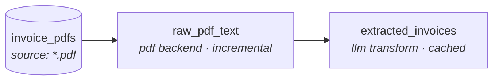

# dbt-ml

**dbt for unstructured data.** dbt-ml brings the dbt workflow — declarative
models, a dependency DAG, `ref()`, tests, incremental builds, lineage, and a
manifest artifact — to folders of documents: PDFs, markdown, HTML, JSON,
email, and free-form text.

dbt users will recognize the workflow: declare sources and models in YAML,
build a DAG, materialize incrementally, test the results, and emit artifacts.
dbt-ml is a standalone CLI rather than a dbt package or dbt adapter.

> **Status: active pure-Python preview.** Shipped capabilities include DuckDB
> and BigQuery warehouses, local and GCS sources, metadata-aware deterministic
> chunk models, record-scoped incremental state, classic text ML, and six
> extraction backends. See
> [`dbt-ml/README.md`](dbt-ml/README.md) for the full reference.

## What a pipeline looks like

A project that turns a folder of invoice PDFs into a structured, queryable
table — extract the text with `pypdf`, then use an LLM to pull typed fields:



Each node is a model declared in YAML. The source globs a folder; `raw_pdf_text`
extracts text per document; `extracted_invoices` calls Claude to turn that text
into typed columns — and caches the result so re-runs are free.

### The source

```yaml
# sources/invoices.yml
version: 2
sources:
  - name: invoice_pdfs
    path: "./data/invoices_pdf/"
    file_pattern: "*.pdf"
```

### The extraction model

```yaml
# models/raw_pdf_text.yml
version: 2
models:
  - name: raw_pdf_text
    source: ref('invoice_pdfs')
    extraction:
      backend: pdf
    materialization: incremental      # re-run only reprocesses changed PDFs
    tests:
      - not_null: [text]
      - unique: source_path
```

### The transform model

```yaml
# models/extracted_invoices.yml
version: 2
models:
  - name: extracted_invoices
    depends_on: [ref('raw_pdf_text')]
    transform:
      type: python
      module: transforms.llm_extract  # a Polars function you write
    tests:
      - not_null: [vendor, invoice_id, total]
      - unique: invoice_id
```

### Run it

```bash
uv run dbt-ml init invoices --template pdf   # scaffold a project
# drop your PDFs into ./invoices/data/invoices_pdf/  (or `dbt-ml seed` synthetic ones)
cd invoices
uv run dbt-ml run                            # build the DAG into DuckDB
uv run dbt-ml test                           # run the schema tests
uv run dbt-ml show raw_pdf_text               # peek at the scaffolded result
```

```
model                 kind        mater.         processed   skipped  deleted    rows   time(s)
-----------------------------------------------------------------------------------------------
raw_pdf_text          extraction  incremental            5         0        0       5     0.31
```

## Why dbt-ml

| | Imperative Python (LlamaIndex) | Managed RAG (Cortex Search, Bedrock KB) | **dbt-ml** |
|---|---|---|---|
| Declarative models + DAG | ✗ | partial | ✓ |
| Tests on extracted data | ✗ | ✗ | ✓ |
| Incremental / cached | DIY | ✓ | ✓ |
| Inspect & swap each stage | ✓ | ✗ | ✓ |
| Lineage / manifest artifact | ✗ | partial | ✓ |
| Reviewable like a dbt PR | ✗ | ✗ | ✓ |
| Composes with existing dbt | ✗ | partial | ✓ |

dbt-ml isn't trying to win on time-to-first-demo (managed services do) or raw
flexibility (LlamaIndex does). It wins on **reproducibility, testability, and
fitting the workflow analytics engineers already use.**

## What's in the box

- **Six extraction backends** — `json`, `markdown`, `pdf`, `html`, `email`,
  and `llm` (Claude tool-use with response caching).
- **Built-in text/ML preprocessing** — token counting, encoding repair,
  language detection, text statistics, near-duplicate detection (MinHash), and
  PII redaction (Microsoft Presidio).
- **Warehouse and source adapters** — DuckDB or BigQuery materialization, with
  local files or generation-pinned GCS objects as source documents.
- **RAG and classic ML primitives** — deterministic recursive/token chunking;
  count, TF-IDF, and hashing features; and naive Bayes text classification.
- **dbt-shaped everything** — `ref()`, `--select` / `--exclude` selectors with
  `tag:` support, structural and deterministic quality tests, custom-Python
  tests, warn/error severities, source freshness, and profiles with `--target`.
- **Compile before I/O** — strict per-backend and classic-ML contracts fail
  before source discovery or warehouse access, with file, line, column, and
  configuration-path diagnostics for invalid YAML.
- **Artifacts** — `manifest.json`, `run_results.json`, a static docs site, and
  `emit-dbt-sources` to hand tables to a dbt project using the matching
  DuckDB or BigQuery adapter.
- **Composes with dbt** — dbt-ml does the unstructured → structured "E"; dbt
  does the SQL "T", reading dbt-ml's tables as native sources.

## Install

```bash
uv add dbt-ml
# Optional cloud integrations:
uv add 'dbt-ml[bigquery,gcs]'
```

## Quickstart

```bash
git clone https://github.com/C00ldudeNoonan/dbt-ml
cd dbt-ml/dbt-ml
uv sync
uv run dbt-ml --project-dir examples/invoice_pipeline seed --count 5
uv run dbt-ml --project-dir examples/invoice_pipeline run
uv run dbt-ml --project-dir examples/invoice_pipeline test
```

Nine runnable projects live in [`dbt-ml/examples/`](dbt-ml/examples/): invoices,
blog posts, support tickets, arXiv quality checks, PDF-to-LLM extraction, direct
LLM extraction, RAG chunks, classic text ML, and a dbt consumer project.

## Security model

Only run projects you trust: Python transforms and custom tests execute in the
dbt-ml process. Project-controlled paths are confined to the project unless an
explicit `external: true` boundary is supported; local source patterns cannot
traverse parents or symlinks. Profiles select destinations and credential names
and must be reviewed as trusted configuration. The LLM backend sends document
text to Anthropic using the configured environment variable, and the PII
transform retains non-target input columns unless you explicitly project or
drop them.
`dbt-ml clean` removes known local artifacts without resetting a warehouse. See
the [full security notes](dbt-ml/README.md#security-notes) before running
third-party projects or sensitive documents.

## Documentation

- **[Full reference](dbt-ml/README.md)** — every backend, command, config block,
  and the roadmap.
- **[Contributing](dbt-ml/CONTRIBUTING.md)** — how to add a backend, test, or
  command.
- **[Semantic retrieval architecture](dbt-ml/docs/architecture/semantic-retrieval.md)**
  — the accepted, not-yet-implemented `search:` resource and retrieval-store
  contract.
- **[Changelog](dbt-ml/CHANGELOG.md)**

## License

[MIT](dbt-ml/LICENSE)
