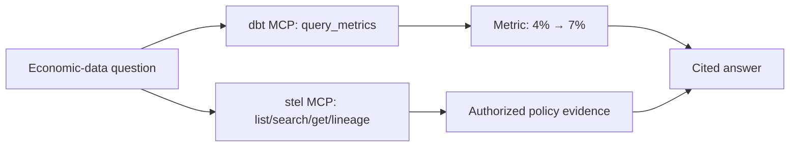

# Metric plus governed evidence agent

This deterministic example answers one economic-data question with two
read-only MCP servers:

> Why did the enterprise refund rate increase in Q2 2026, and what governed
> policy evidence was effective during that quarter?

The result deliberately separates measurement from documentary interpretation.
dbt MCP owns the governed metric query. stel MCP owns governed document
discovery, retrieval, citations, freshness, and lineage. The final wording says
that the evidence is consistent with the metric movement, not that it proves
causation.



## Run it

From the repository root:

```bash
uv run --extra mcp --extra lancedb \
  python examples/metric_evidence_agent/run_demo.py
```

The command builds the offline stel project, starts both MCP servers over the
in-memory MCP transport, runs the question twice, prints the result, and writes
`target/demo_result.json`. No network credentials are required.

The example exercises:

- a JSON source and the `agent_context/v1` document registry, chunks, and entity
  links;
- deterministic embeddings, a governed LanceDB search index, and a native
  deterministic `llm` model;
- `query_metrics` with quarter and customer-segment grouping;
- all four stel context tools with entity and effective-date filters;
- document citations, freshness, source versions, and compact lineage;
- an authorized principal and a reduced-access principal.

The authorized principal belongs to `policy-reviewers` and receives both Q2
policy documents. The reduced-access principal has the same tenant but no
reviewer group, so it receives only the public document. The restricted
document is absent from both its answer and its tool trace.

## Offline fixture and live smoke path

`metric_mcp_fixture.py` implements the current dbt MCP `query_metrics` argument
shape and returns a stable CSV fixture. This keeps CI deterministic while still
exercising a real MCP request rather than calling an in-process helper.

`dbt_project/` contains the equivalent dbt Semantic Layer model and
`refund_rate` ratio metric. For a live smoke test, build that project in an
environment connected to dbt Platform, start or obtain an official dbt MCP
Streamable HTTP endpoint, and opt in:

```bash
DBT_MCP_URL=https://your-dbt-mcp.example/mcp \
DBT_MCP_ACCESS_TOKEN=... \
uv run --extra mcp --extra lancedb \
  python examples/metric_evidence_agent/run_demo.py
```

The access token is optional when the endpoint handles authentication by
another mechanism. It is read only when constructing the MCP connection and is
never included in tool arguments, output, or artifacts. The stel side and
orchestration contract do not change.

`expected_answer.json` and `expected_tool_trace.json` are the reviewed,
deterministic snapshots enforced by the test suite.
